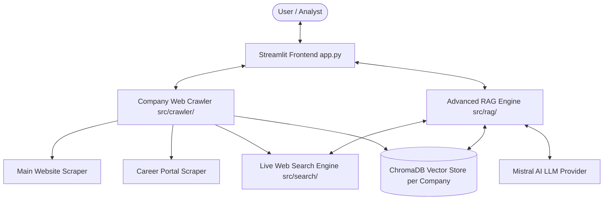

# 🏢 Company RAG Studio

> **Autonomous AI Research Agent for Multi-Company Intelligence, Career Page Analysis, and Context-Aware RAG Chat.**

[](https://www.python.org/)
[](https://github.com/astral-sh/uv)
[](https://streamlit.io/)
[](https://mistral.ai/)
[](https://www.trychroma.com/)

**Company RAG Studio** is a modern, full-stack AI company research platform built with Python `uv`, Streamlit, ChromaDB, and Mistral AI. It allows analysts, job seekers, and researchers to autonomously crawl target company websites, parse dedicated career portals (`/careers`, `/jobs`, culture pages), build isolated multi-tenant vector knowledge bases, and ask complex questions with verified inline citations and dynamic live web search fallback.

---

## ✨ Key Features

- **🎯 Per-Company Vector Storage Isolation**: Each company gets a dedicated ChromaDB collection (e.g. `company_stripe`, `company_openai`). Zero data cross-contamination.
- **🕸️ Targeted Web & Career Crawler**: Asynchronous link discovery engine (`httpx` + `trafilatura` + `BeautifulSoup4`) designed specifically to identify main landing pages, product portals, and career/job listings.
- **🌐 Dynamic Live Web Search Fallback**: Automatically supplements local vector store chunks with live DuckDuckGo web queries when context is sparse or real-time news is requested.
- **🤖 Powered by Mistral AI**: Synthesizes deep insights using `mistral-small-latest` with support for Google Gemini and OpenAI.
- **📌 Inline Source Attribution**: All AI generated answers feature clickable markdown inline citations pointing directly to scraped company URLs.
- **📊 Knowledge Base Inspector**: Visually browse, inspect, and filter vectorized chunks and metadata per company portfolio.

---

## 🏗️ Architecture & System Design



---

## 🛠️ Tech Stack

- **Environment & Dependency Manager**: [`uv`](https://github.com/astral-sh/uv)
- **Frontend / User Interface**: [Streamlit](https://streamlit.io/)
- **LLM Orchestration**: [LangChain](https://www.langchain.com/) + [LangChain MistralAI](https://python.langchain.com/docs/integrations/chat/mistralai/)
- **Vector Database**: [ChromaDB](https://www.trychroma.com/)
- **Web Scraping & Parsing**: `httpx`, `trafilatura`, `BeautifulSoup4`
- **Web Search Engine**: `duckduckgo-search`

---

## 🚀 Quickstart Guide

### 1. Prerequisites
Ensure you have [Python 3.11+](https://www.python.org/) and [`uv`](https://github.com/astral-sh/uv) installed.

```powershell
# Install uv (if not already installed)
powershell -ExecutionPolicy ByPass -c "irm https://astral.sh/uv/install.ps1 | iex"
```

### 2. Clone Repository & Setup Environment

```powershell
git clone https://github.com/sajaljhaa/Company-RAG-Studio.git
cd Company-RAG-Studio
```

### 3. Configure Environment Variables
Copy `.env.example` to `.env` and add your Mistral AI (or Gemini/OpenAI) API key:

```powershell
copy .env.example .env
```

Edit `.env`:
```env
LLM_PROVIDER=mistral
MISTRAL_API_KEY=your_mistral_api_key_here
MISTRAL_MODEL=mistral-small-latest
CHROMA_DB_DIR=./chroma_db
```

### 4. Run the Application
Start the Streamlit dashboard using `uv`:

```powershell
uv run streamlit run app.py
```

Open your browser at 👉 **`http://localhost:8501`**

---

## 📁 Project Structure

```text
Company-RAG-Studio/
├── app.py                      # Main Streamlit Dashboard Application
├── pyproject.toml              # Dependencies and project metadata (managed by uv)
├── uv.lock                     # Deterministic dependency lockfile
├── .env.example                # Environment variables template
├── .gitignore                  # Git exclusion rules
├── llm_wiki/                   # Persistent Project Memory & Knowledge Base
│   ├── README.md               # LLM Wiki Index
│   ├── architecture.md         # Detailed System Architecture
│   └── rag_pipeline.md         # RAG & Crawling Strategy Documentation
└── src/                        # Core Application Modules
    ├── config.py               # Environment configuration loader
    ├── crawler/                # Web crawling & content extraction engine
    │   └── company_crawler.py
    ├── rag/                    # Multi-tenant vector store & RAG synthesis chain
    │   ├── vector_store.py
    │   └── rag_chain.py
    └── search/                 # Live DuckDuckGo web search integration
        └── web_search.py
```

---

## 💡 How to Use

1. **Crawl & Index a Company**:
   - Navigate to the **`🕸️ Crawl & Index Company`** tab.
   - Enter Company Name (e.g., `Stripe`) and Base URL (`https://stripe.com`).
   - Click **"🚀 Start Company Crawling & Indexing"**.
2. **Conduct AI Research**:
   - Go to the **`💬 AI Company Chat`** tab.
   - Ask tailored questions like *"What engineering stack does this company use?"*, *"What are their core product offerings?"*, or *"What open career opportunities do they highlight?"*.
3. **Inspect Portfolio**:
   - Check the **`📊 Knowledge Inspector`** tab to view vectorized chunks and metadata.

---

## 📄 License

Distributed under the MIT License. See `LICENSE` for more information.
