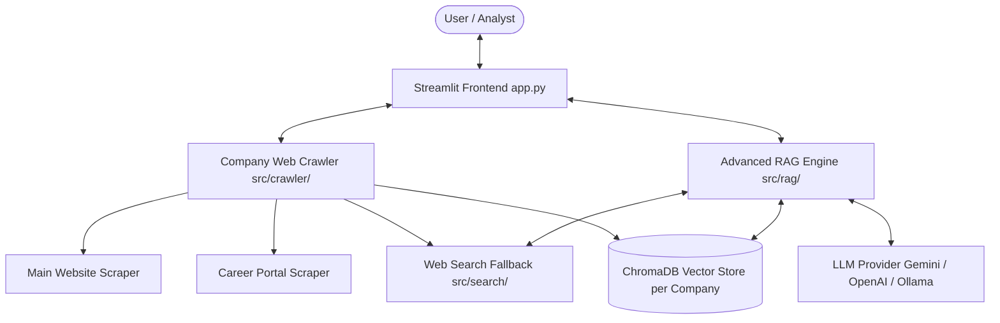

# Architecture & System Design

## Overview Architecture

## Core Principles
1. **Per-Company Isolation**: Each company gets a dedicated ChromaDB collection (e.g. `company_stripe`, `company_google`). This ensures zero data bleed between research subjects.
2. **Targeted Deep Crawling**: The crawler explicitly identifies homepage navigation and career/jobs endpoints (`/careers`, `/jobs`, `/about`, `/culture`, `/work-with-us`).
3. **Structured Context Metadata**: Every document chunk tagged with metadata (`source_url`, `content_type`, `crawled_at`, `title`).
4. **Hybrid Synthesis**: When local RAG confidence is low or query requests live updates, the engine seamlessly blends RAG context with live web search results.
